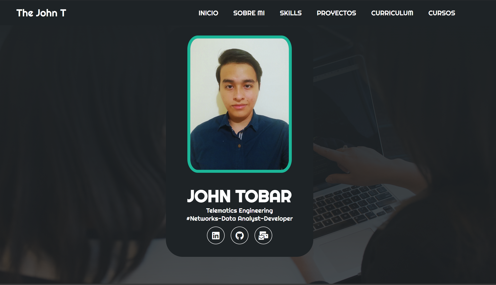

# 🎨 Portafolio HTML, CSS y JavaScript  

  

🚀 Bienvenido a mi portafolio personal, un sitio web desarrollado con **HTML, CSS y JavaScript** para mostrar mis proyectos, habilidades y experiencia.  

## 🌟 Características  

✅ Diseño moderno y responsivo 📱  
✅ Animaciones y efectos dinámicos ✨  
✅ Sección de proyectos con enlaces directos 🔗  
✅ Implementación de JavaScript para interactividad ⚡  

## 🛠️ Tecnologías Utilizadas  

- **HTML** → Estructura del sitio  
- **CSS** → Estilos y diseño responsivo  
- **JavaScript** → Animaciones y lógica interactiva  

## 🔧 Instalación  

Si deseas clonar y modificar este proyecto, sigue estos pasos:  

```bash
git clone https://github.com/jntobar/Portafolio-HTML-CSS-JS.git  
cd Portafolio-HTML-CSS-JS  
